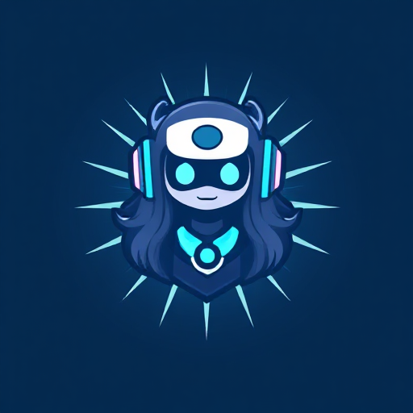

# Chika

[](https://github.com/Jonathan25J/Chika/releases/latest)
[](https://github.com/Jonathan25J/Chika/blob/main/LICENSE)
[](https://github.com/Jonathan25J/Chika/actions/workflows/docker-compose.yml)


With the Chika Discord app is possible to interact with your own hosted language model on Discord. In servers is it possible to use the `/prompt [prompt]` command. You can have conversations with the app in your DM

The app will only listen to one message at a time in your DM. It will look at the most recent message you send after the app has responded. If the app hasn't replied to that message, delete and resend it to trigger a response

The following language models are tested: [*deepseek-r1:1.5b*](https://ollama.com/library/deepseek-r1:1.5b), [*deepseek-r1:7b*](https://ollama.com/library/deepseek-r1:7b),
[*huihui_ai/deepseek-r1-abliterated:14b*](https://ollama.com/huihui_ai/deepseek-r1-abliterated:14b) and [*llama3.1:8b*](https://ollama.com/library/llama3.1:8b)

**Disclaimer**: I am not a professional in the area of language models, so it's possible that the code is not efficient


## Invite app
It's not possible to invite this app.

## Hosting
- Have [Node](https://nodejs.org/en) and [Docker Engine](https://docs.docker.com/engine/) installed
- Create a `.env` file in the root folder with the following content 
```bash
# App
APP_TOKEN = [APP TOKEN]
APP_CLIENT_ID = [APP CLIENT ID]

# Ollama
OLLAMA_MODEL = [LANGUAGE MODEL FROM OLLAMA]
OLLAMA_PORT = [OLLAMA PORT]
OLLAMA_MODE = [GIN MODE] (for example release)
OLLAMA_KEEP_ALIVE= [HOW LONG THE MODEL NEEDS TO BE KEPT IN MEMORY] (for example 24h)

## The cooldown between starting the server and pulling the model
OLLAMA_COOLDOWN_IN_SECONDS = [COOLDOWN IN SECONDS]

## The default prompt given to the model
OLLAMA_MODEL_DEFAULT_PROMPT = [DEFAULT PROMPT]

# The amount of messages read from the Discord DM channel before replying
OLLAMA_MODEL_FETCH_MESSAGE_AMOUNT = [AMOUNT MESSAGES] (for example 10)

OLLAMA_MODEL_TEMPERATURE = [MODEL TEMPERATURE]
OLLAMA_MODEL_MAX_INPUT_TOKEN_LENGTH = [MODEL MAX INPUT TOKEN LENGTH]
OLLAMA_MODEL_MAX_OUTPUT_TOKEN_LENGTH = [MODEL MAX OUTPUT TOKEN LENGTH]
```
- Replace the values inside the brackets `[]` with your values and remove the brackets itself
- Run `docker compose up -d` or `docker compose -f docker-compose-nvidia-gpu.yml up` in case you have a Nvidia GPU. Look [here](https://hub.docker.com/r/ollama/ollama) if you are on Linux or have a AMD GPU
- run `CD app`
- run `npm install`
- Run `node deploy-commands`